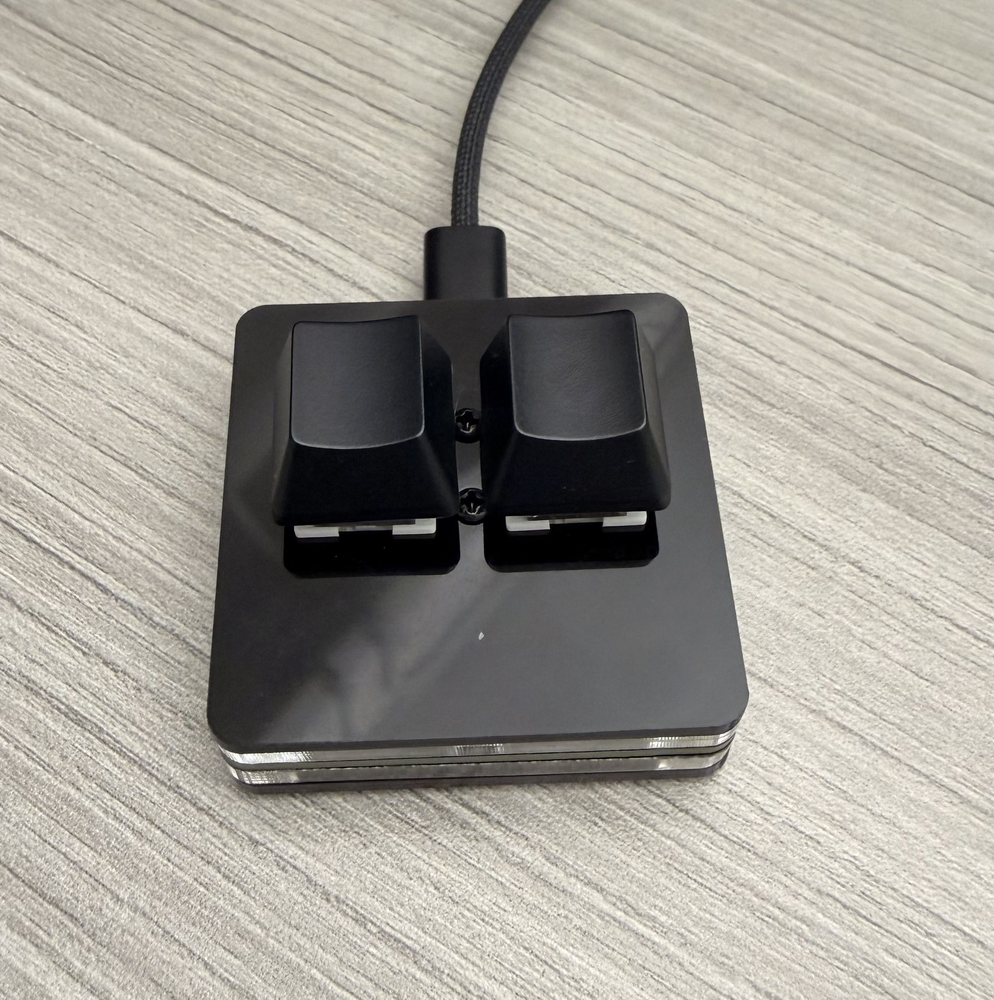

# NEW LANTERN — X-RAY RUNNER

An 8-bit, radiology-themed auto-runner for a 2-key USB keypad (or any keyboard).
You play a radiology pioneer who runs through a neon CT-scanner skyline; **JUMP**
through the scanners flying overhead to X-ray yourself — a glowing skeleton
reveal — and rack up points. The runner speeds up over time, so timing your leaps
gets harder. **BRAKE** slows the run to line up the jump. Runs locally at
`http://localhost:3000`.

> New Lantern is radiology software — hence the X-ray theme.

<p align="center">
  
  <br />
  <em>The 2-key USB pad — one key to brake, one to jump.</em>
</p>

## Run it

```bash
npm install   # first time only
npm start
```

Then open **http://localhost:3000**.

## How to play

- **Two controls only.** `BRAKE` slows your run (a timing tool); `JUMP` leaps up.
- **Brake is finite.** It drains while held and recharges when released — run it dry
  and it locks out (`EMPTY`) until you let go. It also burns *faster the quicker you're
  going*, so braking gets more precious as the run speeds up. Watch the BRAKE gauge.
- Jump so your apex passes *through* a floating scanner → X-ray skeleton + points.
- **Watch the ground, too.** Film cassettes, lead bricks, and radioactive canisters
  scroll in — jump over them, or land on the taller ones for a height boost (handy for
  reaching high scanners). Slamming into one's side costs **SIGNAL** and your combo.
- Missing a scanner also drains your **SIGNAL** bar; empty it and the film is exposed
  (game over). Consecutive hits build a **COMBO** multiplier.
- **Lantern Aura (OVERDRIVE).** Every 8th combo lights a flaming lantern shield around
  your runner that makes you *invincible to obstacles*. It absorbs **one** hit — bash an
  obstacle and the shield breaks (no damage, combo survives), so build the combo back up
  to re-light it. Miss a scanner and the combo (and shield) resets.
- Default keys: `A` = brake, `SPACE` = jump (arrows, `Z`/`X`, etc. also work).

### High scores

Your top 8 runs are saved locally. Beat one and you're prompted for a name — type it and
press **ENTER** (or your **JUMP** key, for pad-only play) to save. The table shows on the
game-over screen with your new entry highlighted, and the leader appears on the title.

### Title-screen options

- **Runner** — Dr. Curie (F) or Dr. Röntgen (M).
- **Difficulty** — Easy · Normal · Hard. Sets the starting run speed and how
  fast it ramps up.
- **Bind Keys** — calibrate brake + jump to your USB 2-key pad (or any keys). It
  shows the exact code each key sends. The pad alone can navigate the menus too:
  brake cycles the runner, jump confirms.

Selections and your best score persist across reloads.

## The fidget visualizer

The original neon synth-pad fidget visualizer still lives at
**http://localhost:3000/widget** — calibrate the pad, then watch ripples, bursts,
bars, and color react to your taps.

## How it captures the keypad

The app listens for browser keyboard events and calls `preventDefault()` on **only
the two calibrated key codes**. Your other input devices — e.g. an Apple Bluetooth
keyboard and a mouse — are never intercepted.

> **Why not read the USB device directly?** macOS blocks apps from opening keyboard
> HID devices (anti-keylogger protection), so a Node `node-hid` backend can enumerate
> the pad but cannot read its input. Browser key events are the reliable path.

### Caveats

- **The browser tab must be focused** for the keys to register.
- The pad's keystrokes still reach macOS system-wide. If your pad sends common
  letters, those could also type into whatever app is focused. To avoid this, remap
  the pad to exotic codes (F13/F14/media keys) in its own firmware, then re-calibrate.
  Calibration shows you exactly what each key currently sends.

## Project layout

```
server.js            Express server: game at /, fidget visualizer at /widget
public/game.html     New Lantern — X-Ray Runner markup + menus
public/game.css       8-bit arcade UI (CRT scanlines, pixel panels)
public/game.js        game engine: input, physics, sprites, X-ray, render
public/index.html    fidget visualizer markup
public/style.css      neon synth-pad styling
public/app.js         fidget input capture, calibration, visualizer
```

Both apps render to a `<canvas>` and capture input the same way (see below); the
game draws at a low internal resolution (320×180) upscaled with nearest-neighbor
for crisp pixels.

## Detected hardware

The target keypad enumerates as **"USB Keyboard"**, VendorID `0x514C`,
ProductID `0x8851`. The app does not hard-code this — it binds to whatever keys you
calibrate — so any USB keypad works.
